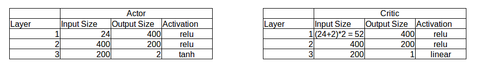
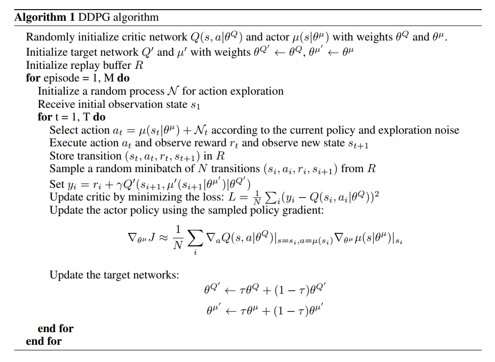
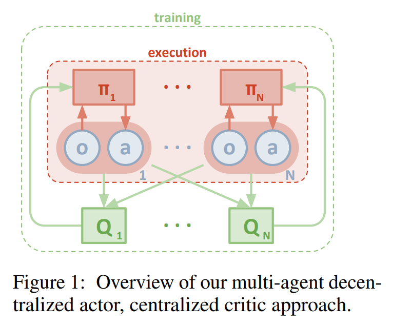
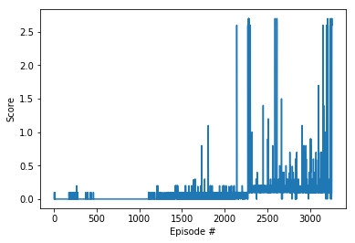
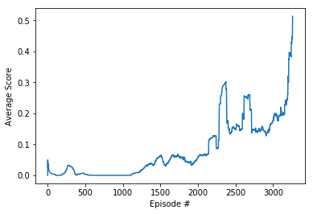

#### Leticia Lorena Rodríguez - Decembre 2018 - Deep Reinforcement Learning Nanodegree - Udacity

## Report: Collaboration and Competition Project

### Introduction

This project solves the Unity3D environment Tennis. 

### Solution

It's solve the environment using a MutipleAgent DDPG. Each agent uses Actor and Critic networks defined in the following way:



The DDPG Algorithm is defined:



The parameters used are:

```
BUFFER_SIZE = int(1e5)  # replay buffer size
BATCH_SIZE = 50        # minibatch size
GAMMA = 0.99            # discount factor
TAU = 1e-3              # for soft update of target parameters
LR_ACTOR = 1e-5         # learning rate of the actor 
LR_CRITIC = 1e-4        # learning rate of the critic
```

In this case, using a MultiAgent, both agents are sharing the Replay Buffer. The learning is performed over both agents experience but the action selection only using the state of the current agent.

As it's indicated in the paper: [Multi-Agent Actor-Critic for Mixed
Cooperative-Competitive Environments](https://papers.nips.cc/paper/7217-multi-agent-actor-critic-for-mixed-cooperative-competitive-environments.pdf)



I've tried different batch sizes: 50, 200, 600 but 50 works well. I've noticed that the network definition have a strong impact in learning. The learning rate should also be carefully choosen. 

The random generation have strong impact in results.  

The plot of the rewards is:




The average reward evolution is:



Finally, the environment was solved in in episode: 3259 with an avg score: 0.51 .

 ### Future work

Some ideas for future work are:
 * Tunning network training: changing learning rates, optimizers, etc.
 * Try implementing a MultiAgent PPO 

